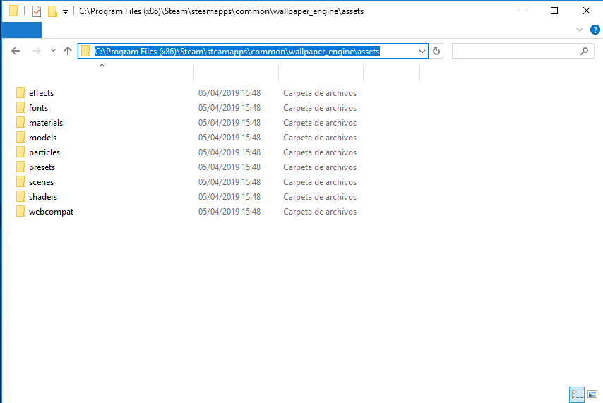

<p align="center">
	<a href="https://github.com/Almamu/linux-wallpaperengine/blob/main/LICENSE"></a>
    <a href="https://github.com/Almamu/linux-wallpaperengine/actions?query=branch%3Amain"></a>
    <a href="https://github.com/Almamu/linux-wallpaperengine/pulse"></a>
	<a href="https://www.codefactor.io/repository/github/almamu/linux-wallpaperengine"></a>
	<a href="https://github.com/Almamu/linux-wallpaperengine/graphs/commit-activity"></a>
	<a href="https://github.com/Almamu/linux-wallpaperengine/graphs/contributors"></a>
	<a href="https://github.com/Almamu/linux-wallpaperengine/issues"></a>
	<a href="https://github.com/Almamu/linux-wallpaperengine/issues?q=is%3Aissue+is%3Aopen+label%3A%22help%20wanted%22"></a>
</p>

# 1. Disclaimer
**This is an educational project**. Although the project started as a learning exercise on the Irrlicht Engine, it has kind of turned into an OpenGL one instead due to limitations and issues with Irrlicht (most likely caused by my limited experience with graphics programming). As it turns out, working directly with OpenGL is not as hard as I thought. For more information on the project's license, check [LICENSE](LICENSE).

# 2. What is this project all about?
This project aims to reproduce the background functionality of Wallpaper Engine on Linux systems. Simple as that.

# 3. What is Wallpaper Engine?
Wallpaper Engine is a software designed by [Kristjan Skutta](https://store.steampowered.com/search/?developer=Kristjan%20Skutta&snr=1_5_9__400) that provides live wallpaper functionality to Windows Systems, allowing its users to animate their own backgrounds and share their own creations. You can find more about it on their [Steam page](https://store.steampowered.com/app/431960/Wallpaper_Engine/).

# 4. Compilation requirements
## linux-wallpaperengine
- OpenGL 2.1 support
- CMake
- LZ4
- ZLIB
- SDL
- FFmpeg
- X11 (with libxxf86vm)
- Xrandr
- GLFW3
- GLM
- GLEW
- GLUT
- FreeImage

## Commands
```
sudo apt update
```
```
sudo apt-get update
```
```
sudo apt -y install cmake lz4 zlib1g ffmpeg libxxf86vm-dev libglm-dev freeglut3-dev libxrandr-dev libavcodec-dev libavformat-dev libavfilter-dev libsdl1.2-dev libsdl-mixer1.2-dev
```
```
sudo apt-get -y install libsdl2-2.0 libsdl-image1.2-dev libsdl1.2-dev libglfw3 libglfw3-dev
```

# 5. How to use
## 5.1. Pre-requirements
In order to properly use this software you'll need to own an actual copy of the Windows version of Wallpaper Engine (which you can buy on the [Steam Page](https://store.steampowered.com/app/431960/Wallpaper_Engine/)), as it contains some basic assets on which most of the backgrounds are based on.

The only way to get those assets is to install the Windows version through Steam. Luckily you don't really need a Windows installation for that. Using the Linux Steam client is enough to download the files we need. Note you may need to check "Enable Steam Play for all other titles" in the Steam Play section of Steam's settings if you haven't already. Also note that the software cannot actually be launched through Steam Play (Proton), but the setting is required for Steam to download the software.

## 5.2. Extracting the assets
The automatic way doesn't require anything extra, as long as Wallpaper Engine is installed in Steam the software should automatically detect where the assets are.

### 5.2.1. Extracting the assets manually
In the off-case where the software doesn't automatically detect the correct path, the assets can be extracted manually. Once Wallpaper Engine is downloaded, open the installation folder (Right-Click the application in Steam -> Manage -> Browse local files). Here you'll see the main folders of Wallpaper Engine. The folder we're interested in is the one named "assets".



The assets folder itself **must** be copied to the same folder where the binary lives.

## 5.3. Getting the sources
You can download a zipped version of the repository here: https://github.com/Almamu/linux-wallpaperengine/archive/refs/heads/main.zip

You can also clone the repository using git like this:
```
git clone git@github.com:Almamu/linux-wallpaperengine.git
```

Or using the HTTPS method if you haven't set up SSH:
```
https://github.com/Almamu/linux-wallpaperengine.git
```

## 5.4. Compilation steps
The project is built on CMake as the build engine. First we need to create the directory where the build will be stored and get into it:

```
mkdir build
cd build
```

Once the folder is created and we're in it, CMake has to generate the actual Makefiles. This can be done this way:
```
cmake ..
```
Take a closer look at the CMake output, if you miss any library, CMake will report the missing libraries so you can install them either trough your package manager or manually in your system.

Finally we can compile the project to generate the actual executable. 
```
make
```

**REMEMBER: The assets folder has to be in the same folder as the executable**

## 5.5. Running a background
### 5.5.1. Running a background from Steam
Just like with the assets, the software can automatically detect where the subscribed backgrounds are stored. To get started, search in the workshop for whatever background you want to use and click the "+Subscribe" button. This should download the background in the steam directory.

To actually use the background you'll need to know the workshop's ID. This can be obtained right-clicking anywhere in the background's page -> "Copy Page URL". You can paste this URL anywhere, it will look something like this:

```
https://steamcommunity.com/sharedfiles/filedetails/?id=1845706469&searchtext=portal+3
```

Where 1845706469 is the wallpaper's ID. You can use this ID to run wallpaperengine:
```
./linux-wallpaperengine 1845706469
```

### 5.5.2. Running a background in a different folder
For the situations where the software cannot detect where the backgrounds are stored, you can specify a full path to it, like so:
```
./linux-wallpaperengine /home/almamu/Development/backgrounds/1845706469/
```

### 5.5.2. Running in a window (Default)
By default the app will load the backgrounds in a window so you can preview them:
```
./linux-wallpaperengine /home/almamu/Development/backgrounds/1845706469/
```

Where `/home/almamu/Development/backgrounds/1845706469/` is the background's path.

### 5.5.3. Running as a screen's background
Only screens configured with the XRandr extension are supported. To specify the screen names (as reported from xrandr tool) just use the ```--screen-root``` switch. You can specify multiple screens at the same time, for example:

**IMPORTANT: Right now this doesn't work if there is anything drawing to the background (like a compositor, gnome, kde, nautilus, etc)**

```
./linux-wallpaperengine --screen-root HDMI-1 --screen-root DVI-D-1 /home/almamu/Development/backgrounds/1845706469/
```

### 5.5.4. Limiting FPS
To reduce the performance hit to your system you can reduce (or increase) the FPS limit with the switch ```--fps```, especially useful for laptops:
```
./linux-wallpaperengine --fps 30
```

## 5.6. Audio
### 5.6.1. Disable audio
It's possible to disable the audio of the background with the silent argument
```
./linux-wallpaperengine --silent
```

## 5.7. Taking a screenshot
It is possible to take a screenshot of the screen's content at the moment a background is loaded up and rendered. Useful for tools like pywal to further customize your environment:
```
./linux-wallpaperengine --screenshot /path/to/screenshot/name.png
```

PNG, BMP and JPEG are supported.

## 5.8. Properties
Some backgrounds have a list of properties that the user can customize. These properties modify how parts of the background behave or look like. Support for these is present.
First, list all the available properties in a background, you can do that with the --list-properties switch:
```
./linux-wallpaperengine --list-properties 2370927443
```

The output includes all the relevant information for each of the different properties:
```
barcount - slider
	Description: Bar Count
	Value: 64
	Minimum value: 16
	Maximum value: 64
	Step: 1

bloom - boolean
	Description: Bloom
	Value: 0
frequency - combolist
	Description: Frequency
	Value: 2
		Posible values:
		16 -> 1
		32 -> 2
		64 -> 3

owl - boolean
	Description: Owl
	Value: 0
rain - boolean
	Description: Rain
	Value: 1
schemecolor - color
	Description: ui_browse_properties_scheme_color
	R: 0.14902 G: 0.23137 B: 0.4 A: 1
visualizer - boolean
	Description: <hr>Add Visualizer<hr>
	Value: 1
visualizercolor - color
	Description: Bar Color
	R: 0.12549 G: 0.215686 B: 0.352941 A: 1
visualizeropacity - slider
	Description: Bar Opacity
	Value: 1
	Minimum value: 0
	Maximum value: 1
	Step: 0.1

visualizerwidth - slider
	Description: Bar Spacing
	Value: 0.25
	Minimum value: 0
	Maximum value: 0.5
	Step: 0.01
```

Any of these values can be modified with the --set-property switch. Say you want to enable the bloom in this background, you would do so like this:
```
./linux-wallpaperengine --set-property bloom=1 2370927443
```

If you keep --list-properties in the commandline you can see how the values change to confirm that it applied properly.

## 6. Example background
This was the first background to even be compatible with the software. And it's not 100% compatible yet. Both textures and shaders are properly loaded, but there are still particles missing.


###### 1845706469
In similar fashion to the example background, this one represents the progress of the program. It leverages FBOs (targets), and multiple-effects over objects.


# 7. Special thanks
- [RePKG](https://github.com/notscuffed/repkg) for the information on texture flags
- [RenderDoc](https://github.com/baldurk/renderdoc) for the so helpful OpenGL debugging tool that simplified finding issues on the new OpenGL code. Seriously this tool ROCKS
