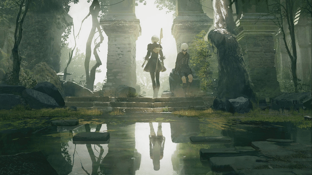

# 1. Disclaimer
**This is an educational project**. Our main focus is to learn how Irrlicht Engine works and provide examples of usage of as much aspects of it as possible. We are not responsible for what others do with the source code downloaded from this project.

# 2. What is this project all about?
This projects aims to reproduce the background functionality of Wallpaper Engine on Linux systems. Simple as that.

# 3. What is Wallpaper Engine?
Wallpaper Engine is a software designed by [Kristjan Skutta](https://store.steampowered.com/search/?developer=Kristjan%20Skutta&snr=1_5_9__400) that provides live wallpaper functionality to Windows Systems, allowing It's users to animate their own backgrounds and sharing their own creations. You can find more about it on their [Steam page](https://store.steampowered.com/app/431960/Wallpaper_Engine/)

# 4. Compilation requirements
- OpenGL 2.1 support
- CMake
- Irrlicht
- LZ4
- ZLIB
- SDL
- SDL_mixer

# 5. How to use
## 5.1. Pre-requirements
In order to properly use this software you'll need to own an actual copy of Window's Wallpaper Engine as it contains some basic assets on which most of the backgrounds are based on. 
The only way to get those assets is to install the Windows version trough Steam. Luckily you don't really need a Windows OS for that. Using the Linux client should be enough to force the download.

## 5.2. Extracting needed assets
Once Wallpaper Engine is downloaded open the installation folder (usually on C:\Program Files (x86)\Steam\steamapps\common\wallpaper_engine). Here you'll see the main folders of Wallpaper Engine. The folder we're interested in is the one named "assets".


All the folders we see must be compressed in a single zip file for the project to load them:


The zip must be named "assets.zip" and placed on the same folder as the directory where the project is going to be run from.

## 5.3. Compilation steps
The project is built on CMake as build engine. First we need to create the directory where the build will be stored and get into it:

```
mkdir build
cd build
```

Once the folder is created and we're in it, cmake has to generate the actual Makefiles. This can be done this way
```
cmake ..
```
Take a closer look at the CMake output, if you miss any library CMake will report the missing libraries so you can install them either trough your package manager or manually in your system.

Finally we can compile the project to generate the actual executable 
```
make
```

**REMEMBER: The assets.zip file has to be at the same folder as the executable**

## 5.4. Running a background
Currently both compressed and uncompressed backgrounds are supported.

#### 5.4.1. Running compressed backgrounds
Compressed backgrounds are actually two separate files. One named "project.json" and another called "scene.pkg". These two files are important as one contains the background's information and the second one contains the needed assets for it. For the program to properly detect them we'll use the ```--pkg``` parameter, which will specify the folder where those two files are stored.
```
./wallengine --pkg folder
```

#### 5.4.2. Running uncompressed backgrounds
Uncompressed backgrounds are just plain folders including all the resources and scene information all jumbled together. At least a project.json and a scene.json must exists for the background to even start loading. For the program to properly detect them we'll use the ```--dir``` parameter, which will specify the folder where the background itself is stored.
```
./wallengine --dir folder
```

###### Example background
This was the first background to even be compatible with the software. And It's not 100% compatible yet. Both textures and shaders are properly loaded, but there are still particles missing.

 