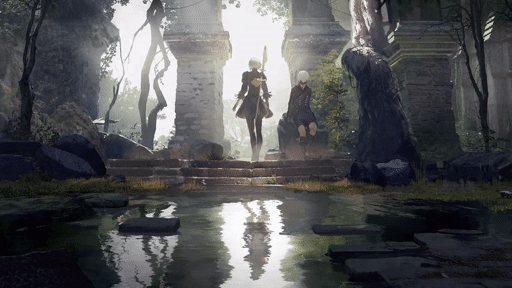

<p align="center">
	<a href="https://github.com/Almamu/linux-wallpaperengine/blob/main/LICENSE"></a>
</p>

# 1. Disclaimer
**This is an educational project**. The project started as a fork from [Almamu/linux-wallpaperengine](https://github.com/Almamu/linux-wallpaperengine) so please check out the original!
For more information on the project's license, check [LICENSE](LICENSE).

# 2. What is this project all about?
This project aims to reproduce the background functionality of Wallpaper Engine on Linux systems. Simple as that. This fork in particular adds a GUI for selecting your wallpapers! 

# 3. What is Wallpaper Engine?
Wallpaper Engine is a software designed by [Kristjan Skutta](https://store.steampowered.com/search/?developer=Kristjan%20Skutta&snr=1_5_9__400) that provides live wallpaper functionality to Windows Systems, allowing its users to animate their own backgrounds and share their own creations. You can find more about it on their [Steam page](https://store.steampowered.com/app/431960/Wallpaper_Engine/).

# 4. Compilation requirements
## linux-wallpaperengine
- OpenGL 3.3 support
- CMake
- LZ4
- ZLIB
- SDL2
- FFmpeg
- X11 (with libxxf86vm) or Wayland
- Xrandr (for X11 support)
- GLFW3
- GLM
- GLEW
- GLUT
- MPV
- PulseAudio
- Qt5

## Commands
```
# Ubuntu
sudo apt-get update
sudo apt-get install build-essential cmake libxrandr-dev libxinerama-dev libxcursor-dev libxi-dev libgl-dev libglew-dev freeglut3-dev libsdl2-dev liblz4-dev libavcodec-dev libavformat-dev libavutil-dev libswscale-dev libxxf86vm-dev libglm-dev libglfw3-dev libmpv-dev mpv libmpv1 libpulse-dev libpulse0 qtbase5-dev

# Fedora
sudo dnf install @development-tools cmake libXrandr-devel libXinerama-devel libXcursor-devel libXi-devel mesa-libGL-devel glew-devel freeglut-devel SDL2-devel lz4-devel libXxf86vm-devel glm-devel glfw-devel mpv-devel qt5-qtbase-devel
```

# 5. How to use
## 5.1. Pre-requirements
In order to properly use this software you'll need to own an actual copy of the Windows version of Wallpaper Engine (which you can buy on the [Steam Page](https://store.steampowered.com/app/431960/Wallpaper_Engine/)), as it contains some basic assets on which most of the backgrounds are based on.

The only way to get those assets is to install the Windows version through Steam. Luckily you don't really need a Windows installation for that. Using the Linux Steam client is enough to download the files we need. Note you may need to check "Enable Steam Play for all other titles" in the Steam Play section of Steam's settings if you haven't already. Also note that the software cannot actually be launched through Steam Play (Proton), but the setting is required for Steam to download the software.

## 5.2. Extracting the assets
The automatic way doesn't require anything extra, as long as Wallpaper Engine is installed in Steam the software should automatically detect where the assets are.

### 5.2.1. Extracting the assets manually
In the off-case where the software doesn't automatically detect the correct path, the assets can be extracted manually. Once Wallpaper Engine is downloaded, open the installation folder (Right-Click the application in Steam -> Manage -> Browse local files). Here you'll see the main folders of Wallpaper Engine. The folder we're interested in is the one named "assets".


The assets folder itself **must** be copied to the same folder where the binary lives.

## 5.3. Getting the sources
You can download a zipped version of the repository here: https://github.com/Almamu/linux-wallpaperengine/archive/refs/heads/main.zip

You can also clone the repository using git like this:
```
git clone git@github.com:Deliasama/linux-wallpaperengine.git
```

Or using the HTTPS method if you haven't set up SSH:
```
https://github.com/Deliasama/linux-wallpaperengine.git
```

## 5.4. Compilation steps
The project is built on CMake as the build engine. First we need to create the directory where the build will be stored and get into it:

```
mkdir build
cd build
```

Once the folder is created and we're in it, CMake has to generate the actual Makefiles. This can be done this way:
```
cmake ..
```
Take a closer look at the CMake output, if you miss any library, CMake will report the missing libraries so you can install them either trough your package manager or manually in your system.

Finally we can compile the project to generate the actual executable. 
```
make
```

**REMEMBER: The assets folder has to be in the same folder as the executable**

## 5.5. Running linux-wallpaperengine
Now you can run the program using the following command:

```
./linux-wallpaperengine
```

## 5.6 Selecting a wallpaper
In the graphical user interface (GUI), start by selecting the desired screen. Then simply click on a wallpaper to display it.

#### Wayland
Has only been tested under wlroots but should work on any flavour as long as wlr-layer-shell-unstable is supported.

#### X11
Only screens configured with the XRandr extension are supported.

**IMPORTANT: Right now this doesn't work if there is anything drawing to the background (like a compositor, gnome, kde, nautilus, etc)**

### 5.6.1 Using custom-flags
To further customize your wallpaper (e.g., adjusting the volume), you can enter one or more of the following flags in the text field at the bottom of the GUI **before** selecting a wallpaper:

| Option | Description |
|--------|-------------|
| `--silent` | Mute background audio |
| `--volume <val>` | Set audio volume |
| `--noautomute` | Don't mute when other apps play audio |
| `--no-audio-processing` | Disable audio reactive features |
| `--fps <val>` | Limit frame rate |
| `--scaling <mode>` | Wallpaper scaling: `stretch`, `fit`, `fill`, or `default` |
| `--clamping <mode>` | Set texture clamping: `clamp`, `border`, `repeat` |
| `--disable-mouse` | Disable mouse interaction |
| `--no-fullscreen-pause` | Prevent pausing while fullscreen apps are running |

## 6. Example background
This was the first background to even be compatible with the software. And it's not 100% compatible yet. Both textures and shaders are properly loaded, but there are still particles missing.


###### 1845706469
In similar fashion to the example background, this one represents the progress of the program. It leverages FBOs (targets), and multiple-effects over objects.



# 7. Special thanks
- [RePKG](https://github.com/notscuffed/repkg) for the information on texture flags
- [RenderDoc](https://github.com/baldurk/renderdoc) for the so helpful OpenGL debugging tool that simplified finding issues on the new OpenGL code. Seriously this tool ROCKS
